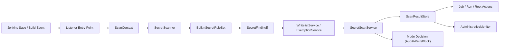

# Jenkins Secret Guard Plugin Architecture

## Overview

Jenkins Secret Guard is a focused Jenkins plugin for detecting and preventing secret leakage in:

- Job `config.xml`
- Pipeline inline scripts
- Pipeline-from-SCM Jenkinsfiles when lightweight SCM access is available
- Build parameter default values
- Environment variable definitions
- Command steps such as `sh`, `bat`, and `powershell`

The MVP is intentionally deterministic:

- no AI
- no generic code-quality rules
- no broad governance workflows

The core flow is:

## Design Goals

- Detect plaintext secrets with high-confidence rules first
- Block only actionable `HIGH` findings in `BLOCK` mode
- Keep reporting and enforcement consistent across save-time and build-time scans
- Make findings human-readable with masking and fixed remediation guidance
- Keep configuration simple enough for Jenkins administrators to adopt quickly

## Subsystems

### 1. Configuration

`SecretGuardGlobalConfiguration` is the single source of truth for runtime behavior:

- plugin enabled flag
- enforcement mode: `AUDIT`, `WARN`, `BLOCK`
- block threshold, default `HIGH`
- rule ID whitelist
- job whitelist
- field name whitelist
- exemptions in `jobFullName|ruleId|reason` format

The configuration is stored using Jenkins `GlobalConfiguration`, so no external storage is required for MVP.

### 2. Domain Model

The model layer standardizes scanning and reporting:

- `Severity`: `LOW`, `MEDIUM`, `HIGH`
- `EnforcementMode`: `AUDIT`, `WARN`, `BLOCK`
- `FindingLocationType`: location classification for XML, Pipeline, environment, parameter default, and command steps
- `ScanPhase`: `SAVE`, `BUILD`, `MANUAL`
- `ScanContext`: immutable scan metadata
- `SecretFinding`: one rule hit with masked snippet and remediation text
- `SecretScanResult`: scan summary with highest severity and blocked flag

This model keeps scanners, listeners, and UI layers loosely coupled.

### 3. Rule Engine

`BuiltInSecretRuleSet` registers all built-in deterministic rules. Rules implement `SecretRule` and produce findings from:

- field names
- raw values
- context
- source location

MVP rules cover:

- sensitive field names such as `token`, `password`, `secret`, `apikey`, `accessKey`, `clientSecret`
- JWTs
- GitHub tokens
- AWS access keys and common secret key patterns
- bearer tokens
- PEM private keys
- credentials embedded in URLs
- secret-bearing URL query parameters such as webhook `?key=` and `?token=`
- hardcoded `httpRequest customHeaders` values, including `maskValue: false`
- high-entropy candidate strings

High-confidence contextual rules take priority over generic fallback rules. For example, when an `httpRequest customHeaders` value is detected, the generic `high-entropy-string` finding for the same line, field, and masked snippet is suppressed.

### 4. Scanners

Two scanners implement `SecretScanner`:

- `ConfigXmlScanner`
  - parses Job `config.xml`
  - walks XML elements and attributes
  - classifies parameter defaults and environment-related nodes
  - extracts inline Pipeline `<script>` contents from Job XML and re-scans the entire script with `PipelineScriptScanner`
  - falls back to raw line scanning when XML parsing fails
- `PipelineScriptScanner`
  - scans Pipeline text line by line
  - tracks `environment {}` scope
  - classifies command steps and HTTP-style secret usage
  - tracks multi-line `httpRequest customHeaders` blocks so header `name`, `value`, and `maskValue` are evaluated together
  - detects URL query secrets in shell commands and other script strings, such as webhook URLs with hardcoded `key` or `token` parameters
  - avoids heavy Groovy parsing in MVP

Pipeline definitions are extracted through `PipelineDefinitionExtractor`:

- inline Pipeline definitions are read from `getDefinition().getScript()`
- Pipeline-from-SCM definitions are read from the configured `scriptPath`, defaulting to `Jenkinsfile`
- SCM Jenkinsfile content is retrieved through Jenkins `SCMFileSystem` lightweight access
- unsupported SCMs or unreadable Jenkinsfiles are skipped without failing saves or builds

The scanner layer is responsible for extracting candidate values and location metadata, not for enforcement.

### 5. Orchestration and Policy

`SecretScanService` is the central coordinator:

- executes the scanner
- applies whitelists
- applies exemptions
- suppresses lower-priority duplicate findings when a more specific rule matches the same source location
- computes whether the result should block
- persists the latest result into `ScanResultStore`

Policy behavior:

- `AUDIT`: record only
- `WARN`: record and allow continuation; build listeners may mark `UNSTABLE`
- `BLOCK`: block only when an unexempted finding is at or above the threshold

### 6. Jenkins Integration

The plugin integrates at three levels:

- `SecretGuardJobConfigFilter`
  - intercepts Job create and config update HTTP requests
  - restores the prior `config.xml` or deletes a newly created Job when `BLOCK` mode rejects the change
- `SecretGuardSaveableListener`
  - scans saved Job configuration
  - records the latest saved Job configuration result after persistence
- `SecretGuardItemListener`
  - refreshes scan results for created or updated items
  - blocks copying a risky Job before the copy is created in `BLOCK` mode
  - complements save-time reporting
- `SecretGuardRunListener`
  - scans inline Pipeline scripts and lightweight Pipeline-from-SCM Jenkinsfiles at build start
  - adds a run action report
  - marks builds `UNSTABLE` in `WARN`
  - interrupts builds in `BLOCK`

### 7. Reporting

Results are exposed through:

- `SecretGuardJobAction`
- `SecretGuardRunAction`
- `SecretGuardRootAction`
- `SecretGuardAdministrativeMonitor`

Job-level reports are available on each Job page so users can run `Scan Now` even before a previous scan result exists.

`ScanResultStore` keeps the latest result in memory and persists one masked latest-result XML file per target under `$JENKINS_HOME/secret-guard/results/`. Reports can be restored lazily after a controller restart without storing raw secret values.

## Current Boundaries

The current implementation deliberately does not include:

- SCM checkout fallback when lightweight `SCMFileSystem` access is unavailable
- multibranch-specific branch indexing integration
- Groovy AST or taint analysis
- plugin-specific deep adapters for every Jenkins plugin
- history trends or long-term scan retention
- approval workflows for exemptions
- AI explanation or remediation generation

## Extension Points

Recommended evolution path:

1. Add more `SecretRule` implementations without changing listener code
2. Add dedicated scanners for plugin-specific configuration blocks
3. Add historical result retention if trend or audit reporting becomes required
4. Add Pipeline step support for explicit in-pipeline scans
5. Add multibranch-specific Jenkinsfile coverage and SCM fallback strategies

## Key Tradeoffs

- **Text scanning over AST parsing**
  - faster to implement
  - easier to reason about
  - may miss deeper semantic misuse
- **Latest-result persistence**
  - keeps restart behavior predictable for MVP reports
  - stores only masked snippets, not raw secret values
  - does not provide historical trends
- **Global configuration only**
  - easy to administer
  - less granular than per-job policy

## Operational Notes

- Use `WARN` first in production rollout to measure noise
- Tighten to `BLOCK` only after tuning whitelists and exemptions
- Review global high-severity findings through the root action and administrative monitor
- Keep exemption reasons specific so future audits remain understandable
